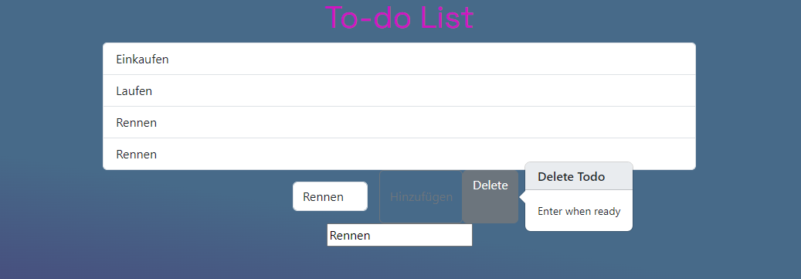

# Todo App mit JS

## Schwierigkeit: Einfach (nur Todos hinzufügen) - Mittel:

## Lernziele: 
 - Eventlistener
 - DOM Manipulation
 - Arbeiten mit einer externen JS Liberary

## Zum [TESTEN](https://sqz0111.github.io/TodoTest/)

Wir möchten nun unsere Todo-App, die wir schon gut design haben mit *html und CSS* um eine *javaScript* erweitern, damit die Todos dynamisch hinzugefügt werden können. Falls nicht vorhanden, liegt eine *style.css* bei. Diese ist auch um eine Animation ergänzt. 

1. Greife als Erstes mit `document.querySelector("element")`das Inputfeld und den Button ab und speichere diese jeweils.

2. Nun soll ein Element erzeugt werden, wenn der Button *betätigt* wird. Füge dafür einen `element.addEventlistener("event",function)`  dem abgegriffenen *Button* hinzu. Denke daran, wenn *nichts* eingeben wurde soll auch kein Element hinzugefügt werden (*Tipp: `if() else`). Mit `document.createElement("element")`können Element erzeugt werden, mit `element.classList.add("class")`, können *Klassen* gesetzt werden.

3. Nun soll ein *Delete-Button* erschaffen werden, welcher bei Eingabe eines dynamisch entstehenden Inputfeld das jeweilig gesuchte Todo sucht und löscht (Löschen bei *Enter*, eine *Pop-over* bei Klick auf den Delete-Button; siehe Bild).
    - Erstelle einen Button mit bestimmten, zusätzlichen *Tags und Attributen*  - [Dokumentation](https://getbootstrap.com/docs/5.0/components/popovers/). Im Notfall kann im Ordner *Cheat* die entsprechende *html* verwendet werden.

    - Schreibe ein *pop-over* Object, indem du das *pop-over* Element erst abgreifst. Auch hier kann `document.querySelector([attribut=attributName])`verwendet werden, wobei man mit den Klammern *[]* ein Element aufgrund eines *Attributs* abgreifen kann. Aus diesem Element erstellt du mit dem *Constructor* `new Bootstrap.Popover(element)` das *pop-over* Objekt.
    
    - Das Element (nicht das *pop-over* Objekt!), welches unser *Pop-Over* darstellt, soll nun ebenfall mit einem *addEventlistener* belegt werden. Dieses Mal soll jedoch auf einen *keypress* gehört werden.
    - Zuerst soll ein *input* Element mit den zugehörigen *Klassen* erschaffen werden und richtig in der *DOM-Struktur* (`element.appendChild()` oder `element.append()`bei mehreren *Child-Elementen*) angefügt werden. Diese sollen auch nur hinzugefügt werden, wenn es diese noch nicht gibt.

    - Auf das *dynamisch* erzeugte Eingabefeld soll ein weiterer *eventListner* draufliegen, welcher auf *keypress* hört. Alle Todos sollen mit einer *Schleife* durchlaufen werden. Hat einer dieser Todos den Inhalt von dem dynamisch erzeugten Eingabefeld, wird das Todo aus der *DOM-Struktur* entfernt. Zuletzt wird die *blur* *Klasse* auf das dynamische Eingabefeld angewandt. Nach zwei Sekunden soll das Eingabefeld von der *DOM-Struktur* entfernt werden.
# To-Do-App
